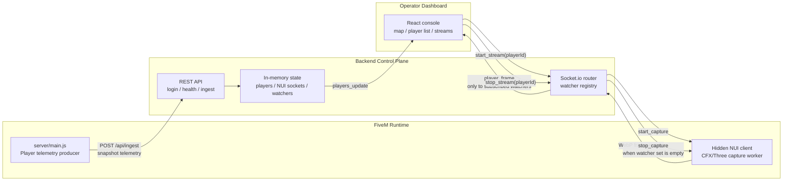

# Technical Architecture

`fivem-watch` is a self-hosted real-time observability console for FiveM operations.

The core design is a centralized, watcher-scoped relay with distributed capture at the edge. The backend is not a passive tunnel; it is the control plane that authenticates actors, accepts telemetry, tracks NUI producers, counts watchers, and decides where frames are allowed to go.

## Architecture Thesis

```txt
Keep game runtime work minimal.
Keep stream capture demand-driven.
Keep routing policy centralized.
Keep deployment boring enough to run yourself.
Make the streaming path feel live without making it always-on.
```

This is why the project uses a backend relay instead of P2P streaming. P2P can look impressive in a diagram, but admin tooling needs predictable auth, firewall behavior, cleanup, and policy enforcement. The relay model gives one place to own those decisions, which is exactly what an operations console needs.

The capture workload is still distributed: each player-side NUI client owns its own capture and encode path. The backend does not perform FiveM screenshot capture work; it coordinates demand and relays frames to authorized watchers. That split is the whole trick: edge capture for cost, central control for sanity.

## High-Level Flow



The backend stays centralized for policy and routing. Capture work is distributed to each player-side NUI client, so the FiveM server is not doing frame processing and the backend is not running screenshot capture. The system gets the "live camera" feel without paying for constant capture.

## Runtime Components

### Game Edge

Runs inside FiveM.

- `server/main.js` collects player snapshots.
- `client/main.js` initializes the hidden NUI page.
- `web/index.html` captures frames through the WebGL/NUI path.
- `web/cfx-three.min.js` provides the bundled CFX/Three capture runtime used by the NUI page.

The game edge emits state and frames. It does the expensive visual work only when asked, and it does not own routing policy.

### Backend Control Plane

Runs as a Node.js service.

- Express handles login, health, and ingest.
- Socket.io handles realtime state and stream commands.
- In-memory indexes track admins, NUI clients, active streams, and watcher sets.

The backend owns the stream lifecycle: who can watch, which NUI should capture, who receives frames, and when capture must stop.

### Operator Dashboard

Runs in the browser.

- Authenticates through the backend.
- Receives player telemetry.
- Renders the player list and GTA V map.
- Opens stream overlays.
- Sends stream quality updates.

The dashboard is a control surface, not the source of routing truth. It asks for visibility; the backend decides how that visibility is safely delivered.

## Telemetry Model

Telemetry is snapshot-based.

```txt
FiveM server
  -> collect current players
  -> POST /api/ingest
  -> backend replaces playersState
  -> backend emits players_update
  -> dashboard renders latest state
```

Properties:

- latest snapshot wins
- missed updates self-heal on the next interval
- no persistence required
- low operational overhead

This is the right trade for live visibility. Operators need current state more than historical reconstruction, and snapshots keep that path brutally simple.

## Stream Model

Streaming is demand-driven.

```txt
operator clicks watch
  -> dashboard emits start_stream(playerId)
  -> backend registers watcher
  -> backend asks that player's NUI to start_capture
  -> NUI sends WebP frame events
  -> backend relays frames only to watchers
```

When the final watcher leaves:

```txt
watcher set becomes empty
  -> backend emits stop_capture
  -> NUI stops capture loop
```

This avoids global broadcast and duplicate capture loops. One player, one capture loop, only the watchers who asked for it.

## Capture Pipeline

The stream path is intentionally local to the player-side NUI client.

```txt
CfxTexture
  -> WebGL render target at configured scale
  -> readRenderTargetPixels
  -> packed canvas ImageData
  -> WebP data URL
  -> Socket.io frame event
```

The project bundles the required CFX/Three runtime and uses only the capture primitives needed for this pipeline. It does not require a separate screenshot resource at runtime, and it avoids routing raw capture work through FiveM server-side code.

The resize work happens before readback by sizing the WebGL render target to `window size x resolutionScale`. The NUI then packs the scaled RGBA buffer into canvas `ImageData` and encodes that smaller frame as WebP. That means fewer pixels are copied out of the GPU and fewer bytes are encoded and relayed.

Earlier versions can be implemented by forwarding screenshot-resource output through the backend. The current design is cleaner and lighter: capture and encode happen at the edge, while the backend remains a control-plane relay instead of becoming a screenshot processing bottleneck.

## In-Memory State

Current backend state:

```ts
playersState: PlayerData[]
nuiClients: Map<PlayerId, SocketId>
adminSockets: Set<SocketId>
activeStreams: Set<PlayerId>
streamWatchers: Map<PlayerId, Set<AdminSocketId>>
```

Why in memory:

- fastest possible local lookups
- no mandatory database
- easy self-hosted deployment
- enough for a single-node control plane

Known trade-off:

> backend restart clears runtime state; connected actors reconnect and rebuild it.

## Watcher-Scoped Relay

Naive broadcast:

```txt
frame from player A -> every admin
```

`fivem-watch` routing:

```txt
frame from player A -> admins watching player A
```

Cost shape:

```txt
active streams x watchers per stream
```

instead of:

```txt
active streams x all connected admins
```

This is the important property: stream cost follows operator intent. The system looks live because it is live, but it only spends real resources on streams someone actually opened.

## Trust Zones

```txt
Zone A: FiveM host and player clients
  - telemetry producer
  - NUI frame producer

Zone B: Backend control plane
  - auth
  - ingest validation
  - stream routing
  - watcher accounting

Zone C: Operator browser
  - authenticated control and viewing surface
```

The backend is the trust boundary between game-side producers and operator-facing consumers.

## Security Posture

Current version uses a shared secret for:

- telemetry ingest
- NUI socket admission
- admin socket token

This is acceptable for controlled self-hosted deployments. For public or hostile environments, harden before exposure:

1. Short-lived JWTs for dashboard sessions.
2. Separate secrets for ingest, NUI, and admin roles.
3. Rate limiting for login and ingest.
4. TLS everywhere.
5. Strict CORS allowlists.
6. Role-scoped admin capabilities.
7. Signed ingest payloads with timestamp/nonce if replay protection matters.

## Reliability Model

| Failure | Expected behavior |
|---|---|
| Backend restart | Runtime state resets; actors reconnect |
| FiveM ingest interruption | Dashboard updates resume on next successful snapshot |
| NUI disconnect | Active stream fails until the NUI reconnects |
| Admin disconnect | Watcher membership is cleaned up |
| Last watcher leaves | Backend stops capture |
| Dropped telemetry payload | Next snapshot repairs state |

## Performance Controls

Telemetry:

```txt
TELEMETRY_INTERVAL
```

Streaming:

```txt
STREAM_FPS
STREAM_RESOLUTION_SCALE
STREAM_QUALITY
```

Tuning order:

1. Reduce resolution scale.
2. Reduce FPS.
3. Reduce quality.

The main constraint is frame throughput, not telemetry.

## Scaling Path

The current architecture is single-node optimized.

To scale horizontally:

1. Add a Socket.io Redis adapter.
2. Move player/session indexes into shared cache.
3. Use sticky sessions or consistent stream ownership.
4. Split frame relay into media gateway workers.
5. Add adaptive stream policies by operator bandwidth.
6. Add persistence only if replay/history becomes a real product requirement.

Future topology:

```txt
Operator Browser
  -> Load Balancer
  -> Control Plane Nodes
  -> Shared Socket/Session State
  -> Media Gateway Workers
```

That is a scale-up path, not a prerequisite for the current project.
