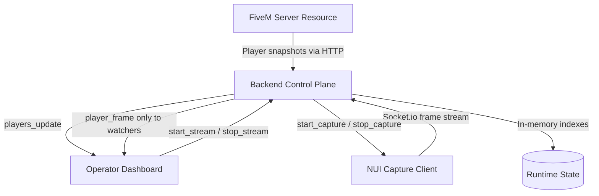

# Technical Architecture

`fivem-watch` is a remote operator dashboard for multiplayer servers.

It replaces manual in-game spectating workflows with a web-based control plane that streams player state, map position, and live session context to authenticated operators.

The system is designed around one core idea:

> keep the game-side resource lightweight, push orchestration into the backend, and only stream expensive media when an operator is actually watching.

---

## What Problem Does It Solve?

In many multiplayer server operations, moderators or admins need to enter the game and manually spectate players to understand what is happening.

That workflow has problems:

- it requires operators to join the game
- it adds friction during live moderation
- it does not scale well when multiple operators need visibility
- it mixes operational monitoring with gameplay
- it gives limited centralized context

`fivem-watch` moves that workflow into a remote dashboard.

Operators can inspect player position, state, and live session context from the browser without manually attaching themselves to the in-game spectate flow.

---

## Design Goals

The project is optimized for small-to-mid self-hosted multiplayer communities.

Primary goals:

- near real-time player state updates
- remote operator dashboard for live monitoring
- on-demand player stream relay
- watcher-scoped media routing
- minimal game-client runtime overhead
- simple self-hosted deployment
- no mandatory database or long-term storage requirement

Non-goals for the current version:

- long-term replay/archive system
- multi-tenant SaaS authorization model
- exactly-once delivery
- enterprise-scale media distribution
- full anti-cheat or enforcement engine

This is an operator visibility tool, not a full moderation platform.

---

## High-Level Architecture



The architecture is split into three bounded contexts:

1. **Game Edge**
   - runs inside the FiveM environment
   - collects player state
   - starts/stops NUI capture
   - sends telemetry and frames outward

2. **Backend Control Plane**
   - authenticates actors
   - receives telemetry snapshots
   - tracks connected admins and NUI clients
   - routes frames only to interested watchers

3. **Operator Experience**
   - web dashboard
   - map overlays
   - player list
   - live stream viewer
   - stream control UI

This keeps game-native code lean and moves routing, policy, and orchestration into the backend.

---

## Runtime Topology

```txt
FiveM Server
  ├─ server/main.js
  │    └─ collects player snapshots
  │    └─ POST /api/ingest
  │
  ├─ client/main.js
  │    └─ bootstraps NUI capture context
  │
  └─ web/index.html
       └─ captures game viewport frames
       └─ sends frame events over Socket.io


Backend Server
  ├─ Express REST API
  ├─ Socket.io router
  ├─ in-memory player state
  ├─ in-memory socket indexes
  └─ stream watcher registry


Operator Browser
  ├─ React dashboard
  ├─ Leaflet map layer
  ├─ player list
  └─ live stream viewer
```

---

## Data Flow

## 1. Player Telemetry Flow

```txt
FiveM server resource
      ↓
collect player state snapshot
      ↓
POST /api/ingest
      ↓
backend updates playersState
      ↓
Socket.io emits players_update
      ↓
operator dashboard updates map/list UI
```

Telemetry is snapshot-based.

Characteristics:

- latest snapshot wins
- delivery is at-most-once per interval
- missed updates self-heal on the next ingest cycle
- no long-term persistence is required
- frontend always renders the latest known state

This is intentionally simpler than event sourcing because operators need current visibility more than historical reconstruction.

---

## 2. Live Stream Flow

```txt
operator clicks watch
      ↓
dashboard emits start_stream(playerId)
      ↓
backend resolves target NUI socket
      ↓
backend emits start_capture
      ↓
NUI captures WebGL frames
      ↓
NUI sends frame events
      ↓
backend relays frames only to watchers of that player
      ↓
operator dashboard renders live stream
```

The stream exists only while at least one operator is watching.

When the watcher count reaches zero:

```txt
last watcher disconnects / stops watching
      ↓
backend removes watcher
      ↓
watcher set becomes empty
      ↓
backend emits stop_capture
      ↓
NUI stops frame capture
```

This prevents unnecessary frame capture, CPU usage, and bandwidth consumption.

---

## Backend In-Memory Model

The backend is currently optimized for a single-node, low-dependency deployment.

Core runtime structures:

```ts
playersState: PlayerData[]

nuiClients: Map<PlayerId, SocketId>

adminSockets: Set<SocketId>

activeStreams: Set<PlayerId>

streamWatchers: Map<PlayerId, Set<AdminSocketId>>
```

Why in-memory?

- simple deployment
- low latency lookups
- no mandatory Redis/database dependency
- O(1) routing from playerId to NUI socket
- constant-time watcher membership updates

Trade-off:

> horizontal scaling requires externalized socket state, sticky sessions, or a dedicated media relay layer.

For the current target audience, operational simplicity is more valuable than distributed scalability.

---

## Stream Routing Model

The most important design decision is watcher-scoped frame routing.

Naive approach:

```txt
NUI frame
  ↓
broadcast to every admin
```

Problem:

- wastes bandwidth
- sends frames to uninterested operators
- creates unnecessary browser/rendering load
- amplifies traffic as admin count grows

`fivem-watch` approach:

```txt
NUI frame for player A
  ↓
backend checks streamWatchers[playerA]
  ↓
relay only to admins watching player A
```

This keeps frame delivery proportional to actual demand.

```txt
cost ≈ active streams × watchers per stream
```

instead of:

```txt
cost ≈ active streams × all connected admins
```

---

## Component Breakdown

## 1. FiveM Server Resource

Responsibilities:

- gather player state using native server/runtime calls
- build snapshot arrays
- send snapshots to the backend ingest endpoint
- avoid heavy processing inside the game runtime
- keep telemetry push-only

Example:

```txt
server/main.js
  ↓
collect players
  ↓
POST /api/ingest
```

Design principle:

> the game resource should emit state, not own orchestration.

---

## 2. NUI Capture Client

Responsibilities:

- receive `start_capture` / `stop_capture`
- capture the game viewport through the NUI/WebGL path
- encode frames as compressed image payloads
- send frame events over Socket.io
- apply runtime stream config such as FPS, scale, and quality

Capture is on-demand.

The NUI client should not continuously capture frames when no operator is watching.

---

## 3. Backend Control Plane

Responsibilities:

- authenticate ingest and socket actors
- receive telemetry snapshots
- maintain latest player state
- maintain socket indexes
- route admin commands
- start and stop NUI capture sessions
- relay frames only to active watchers

Main backend concepts:

```txt
REST API        -> auth, health, ingest
Socket.io       -> bidirectional control and frame routing
In-memory state -> player snapshots and socket indexes
```

The backend acts as the policy and routing authority between all zones.

---

## 4. Operator Dashboard

Responsibilities:

- authenticate the operator
- open and maintain Socket.io connection
- render player list
- render map overlays
- start/stop player streams
- display live session context
- apply stream quality controls

The dashboard should be thin.

Business routing logic stays in the backend control plane.

---

## API and Event Contract

## REST API

```txt
POST /api/auth/login
```

Request:

```json
{
  "username": "admin",
  "password": "password"
}
```

Response:

```json
{
  "success": true,
  "token": "..."
}
```

---

```txt
GET /api/health
```

Returns process health and aggregate runtime counts.

---

```txt
POST /api/ingest
```

Headers:

```txt
x-api-key: <server-secret>
```

Body:

```json
[
  {
    "id": 12,
    "name": "player_name",
    "coords": {
      "x": 123.4,
      "y": 456.7,
      "z": 21.0
    },
    "health": 190,
    "armor": 50
  }
]
```

---

## Socket Roles

```txt
admin
fivem-server
fivem-nui
```

---

## Admin Commands

```txt
start_stream(playerId)
stop_stream(playerId)
update_stream_config({ playerId, config })
```

---

## Admin Events

```txt
players_update(players)
player_frame({ playerId, frame })
stream_error({ playerId, error })
server_offline
```

---

## NUI Control Events

Inbound:

```txt
start_capture
stop_capture
update_config
```

Outbound:

```txt
frame(base64Image)
```

---

## Trust Zones

```txt
Zone A: FiveM Host
  - telemetry producer
  - NUI frame producer

Zone B: Backend Host
  - auth
  - ingest validation
  - stream routing
  - policy enforcement

Zone C: Operator Browser
  - authenticated read/control client
```

The backend is the trust boundary between game-side producers and operator-facing consumers.

---

## Security Posture

## Current Posture

Current version uses a shared secret for:

- ingest authorization
- socket admission
- admin token validation

This is acceptable for controlled self-hosted environments but should be hardened before hostile/public deployments.

---

## Known Risks

- shared secret reuse increases blast radius
- no short-lived token semantics
- no role-scoped cryptographic claims
- ingest endpoint can be abused if exposed publicly
- no replay protection for ingest payloads

---

## Recommended Hardening Path

1. Introduce JWT access tokens with short TTL.
2. Separate secrets per actor class:
   - server ingest
   - NUI capture
   - admin dashboard
3. Add rate limiting for:
   - `/api/auth/login`
   - `/api/ingest`
4. Enforce TLS termination.
5. Add strict CORS allowlists.
6. Add nonce/timestamp signatures for ingest replay protection.
7. Add role-scoped claims for admin capabilities.

Security rule:

> authentication should prove identity, but authorization should decide what an actor can do.

---

## Reliability Model

Expected failure behavior:

| Failure | Behavior |
|---|---|
| Backend restart | In-memory state resets; actors reconnect and repopulate state |
| FiveM telemetry interruption | Dashboard shows stale state until next successful ingest |
| NUI disconnect | Active stream fails or pauses until reconnect |
| Admin disconnect | Watcher membership is garbage-collected |
| Last watcher leaves | Backend stops capture for that player |
| Dropped telemetry payload | Next snapshot self-heals state |

Recovery model:

- Socket.io reconnection restores actors
- snapshot telemetry converges naturally
- repeated `start_stream` calls are idempotent
- watcher cleanup prevents orphaned capture loops

---

## Performance Controls

The project exposes runtime controls for tuning cost and latency.

Telemetry:

```txt
TELEMETRY_INTERVAL
```

Stream:

```txt
STREAM_FPS
STREAM_RESOLUTION_SCALE
STREAM_QUALITY
```

Guidance:

- bandwidth constrained → reduce `STREAM_RESOLUTION_SCALE`
- CPU constrained on NUI/client → reduce `STREAM_FPS`
- visual artifacts acceptable → reduce `STREAM_QUALITY`
- operator only needs rough context → reduce both FPS and quality

The important constraint:

> streaming should be paid for only when someone is watching.

---

## Scalability Roadmap

Current architecture is single-node optimized.

To scale beyond one backend process:

1. Externalize Socket.io state using Redis adapter.
2. Move player/session indexes into shared cache.
3. Introduce sticky sessions or consistent routing for stream ownership.
4. Split frame relay into dedicated media gateway workers.
5. Add adaptive stream policy by operator bandwidth/client capacity.
6. Add persistent event storage if historical replay becomes a product goal.

Suggested future topology:

```txt
Operator Browser
      ↓
Load Balancer
      ↓
Backend Control Plane
      ↓
Redis Socket Adapter
      ↓
Media Relay Workers
      ↓
NUI Capture Clients
```

---

## Observability Baseline

Recommended production metrics:

- ingest RPS
- ingest error rate
- active admins
- active streams
- watcher count per player
- frame throughput
- stream startup latency
- capture-to-browser latency
- socket disconnect rate
- auth failures

Suggested initial targets:

- telemetry freshness P95 under 2.5s
- stream startup P95 under 3s
- frame relay success rate above 99% under nominal load

These are baseline targets, not guarantees.

They should be measured and adjusted based on real deployment conditions.

---

## Architecture Decisions

## ADR-001: In-memory state over external datastore

Decision:

> keep runtime state in memory for the first version.

Reason:

- simpler deployment
- lower operational cost
- low-latency routing
- enough for single-server communities

Trade-off:

- horizontal scaling requires external coordination

---

## ADR-002: Socket.io for control and stream channels

Decision:

> use Socket.io for bidirectional events.

Reason:

- reconnect behavior
- room/socket abstractions
- browser-friendly
- good fit for control commands and live updates

Trade-off:

- raw WebSocket may be leaner
- scaling needs adapter support

---

## ADR-003: On-demand WebGL/NUI capture

Decision:

> only capture frames when an operator is watching.

Reason:

- avoids constant media cost
- reduces game/client runtime overhead
- aligns resource usage with real operator demand

Trade-off:

- stream startup has initial latency
- NUI capture path needs careful tuning

---

## ADR-004: Snapshot telemetry over event sourcing

Decision:

> use latest-state snapshots for player telemetry.

Reason:

- operator dashboard needs current state
- missed snapshots self-heal
- no database required
- simpler than maintaining event history

Trade-off:

- no built-in historical replay
- stale data must be handled in UI

---

## Summary

`fivem-watch` is built around a practical operational workflow:

> help operators understand live server context without manually entering the game and spectating players.

The architecture keeps the game-side resource lightweight, moves orchestration into a backend control plane, and routes expensive live media only to operators who explicitly request it.

The result is a self-hosted remote operator dashboard with real-time player telemetry, map context, and watcher-scoped live stream relay.
